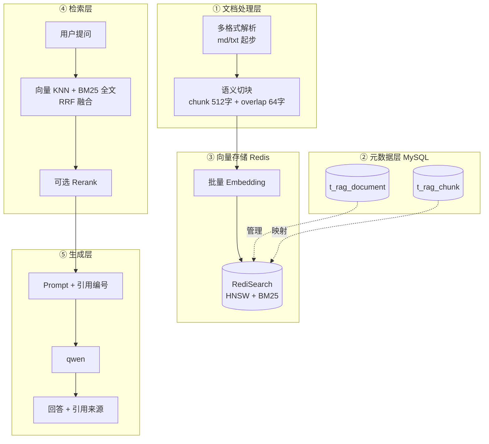
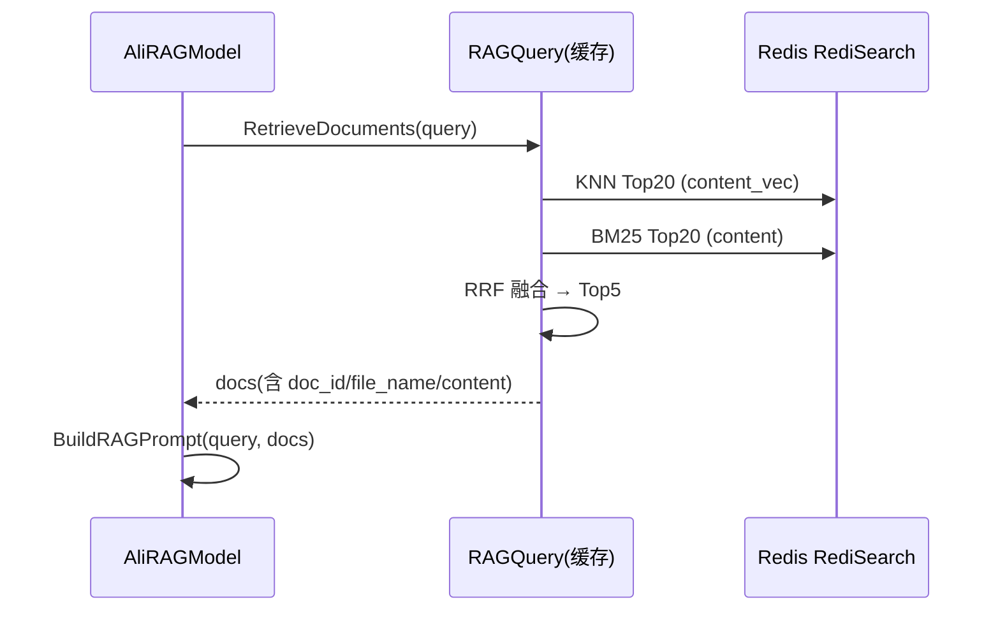

# GopherAI RAG 检索增强系统 · 详细设计文档

> 本文档基于项目现有 RAG 实现（Eino + Redis RediSearch + 阿里百炼 embedding/qwen），
> 给出从"单文档整文件"升级到"多文档 + 语义切块 + 混合检索 + 引用溯源"的完整落地方案。
> 所有命名、目录、错误码、代码风格均与现有项目对齐，可直接据此开发。

---

## 目录

1. [背景与目标](#1-背景与目标)
2. [现状与问题](#2-现状与问题)
3. [总体架构](#3-总体架构)
4. [数据模型设计](#4-数据模型设计)
5. [向量存储与索引设计](#5-向量存储与索引设计)
6. [文档切块算法设计](#6-文档切块算法设计)
7. [模块改造设计](#7-模块改造设计)
8. [检索与生成流程设计](#8-检索与生成流程设计)
9. [接口设计](#9-接口设计)
10. [错误码设计](#10-错误码设计)
11. [配置变更](#11-配置变更)
12. [分阶段实施计划](#12-分阶段实施计划)
13. [风险与兼容性](#13-风险与兼容性)

---

## 1. 背景与目标

### 1.1 背景

现有 RAG 采用「上传单个文本文件 → 整文件向量化 → Redis 向量检索 → 拼 prompt → qwen 生成」的朴素链路。
实现位于：

- `common/rag/rag.go`：索引器 / 查询器 / prompt 构建
- `common/redis/redis.go`：RediSearch 向量索引管理
- `service/file/file.go`：文件上传与索引构建
- `common/aihelper/model.go`：`AliRAGModel`（modelType="2"）检索与生成编排

### 1.2 目标

| 目标 | 说明 |
|------|------|
| 语义切块 | 大文件按块存储，解决整文件超 token 截断、召回粒度粗的问题 |
| 多文档支持 | 每个用户可上传多个文档，去掉"单文档"约束 |
| 元数据持久化 | 文档/块信息落 MySQL，支持重启恢复、精确删除 |
| 混合检索 | 向量（语义）+ BM25（关键词）双路召回，RRF 融合 |
| 引用溯源 | 回答附带来源文档与原文片段 |
| 查询器复用 | embedder 全局单例，retriever 按用户缓存，降低延迟 |

---

## 2. 现状与问题

### 2.1 现状数据流

```
上传 .md/.txt → 存 uploads/{username}/{uuid}.ext
             → FT.CREATE rag_docs:{uuid}:idx（FLAT + COSINE）
             → 整文件作为一个 Document（ID 固定 "doc_1"）→ Embedding → Store

提问 → NewRAGQuery 扫描用户目录取"第一个文件名" → FT.SEARCH TopK=5
     → BuildRAGPrompt → 替换最后一条用户消息 → qwen 生成
```

### 2.2 问题清单

| # | 问题 | 影响 |
|---|------|------|
| 1 | **无文本切块**：整文件一个 `Document`，`ID="doc_1"` | 超 token 截断/失败；检索粒度为"整文件"，召回精度差；多 chunk 会互相覆盖 |
| 2 | **单文档 + UUID 文件名强耦合**：查询靠扫描目录取文件名 | 无法多文件；逻辑脆弱 |
| 3 | **无元数据表**：文档/索引状态不落库 | 重启无法恢复；无法精确管理 |
| 4 | **每次请求重建查询器**：新建 embedder + retriever + 扫目录 | 延迟高、连接浪费 |
| 5 | **检索质量弱**：纯向量、FLAT 索引、无混合检索/rerank/query 改写 | 关键词类问题命中差、规模大时慢 |
| 6 | **无引用溯源** | 回答不可追溯，无法验证 |
| 7 | **API Key 硬编码 `OPENAI_API_KEY`**：与配置耦合 | 部署不灵活 |

---

## 3. 总体架构

### 3.1 目标架构



### 3.2 关键标识规范

统一采用 `user_id + doc_id + chunk_id` 三级标识，替代"UUID 文件名"：

```
Redis Key  : rag:{user_id}:{doc_id}:{chunk_id}
索引名      : rag:{user_id}:idx
Key 前缀    : rag:{user_id}:
```

- `user_id`：JWT 中的 `userName`（现有系统以此为租户隔离维度）
- `doc_id`：文档 UUID（`utils.GenerateUUID()`）
- `chunk_id`：块 UUID（每个块一个，落库到 `t_rag_chunk.id`，同时作为 Redis Key 尾段）

---

## 4. 数据模型设计

### 4.1 表结构

新增两张表（与现有 `t_user` / `t_session` / `t_message` 命名风格一致）。

#### 4.1.1 `t_rag_document` — 知识库文档

```sql
CREATE TABLE `t_rag_document` (
  `id`          VARCHAR(36)  NOT NULL COMMENT '文档ID(UUID)',
  `user_id`     VARCHAR(50)  NOT NULL COMMENT '所属用户(对应user.username)',
  `file_name`   VARCHAR(255) NOT NULL COMMENT '原始文件名',
  `file_path`   VARCHAR(512) NOT NULL COMMENT '服务器存储路径',
  `file_ext`    VARCHAR(10)  NOT NULL DEFAULT '' COMMENT '扩展名',
  `status`      TINYINT      NOT NULL DEFAULT 0 COMMENT '0处理中/1就绪/2失败',
  `chunk_count` INT          NOT NULL DEFAULT 0 COMMENT '切块数量',
  `created_at`  DATETIME     DEFAULT NULL,
  `updated_at`  DATETIME     DEFAULT NULL,
  `deleted_at`  DATETIME     DEFAULT NULL,
  PRIMARY KEY (`id`),
  KEY `idx_rag_doc_user` (`user_id`),
  KEY `idx_rag_doc_deleted` (`deleted_at`)
) ENGINE=InnoDB DEFAULT CHARSET=utf8mb4 COMMENT='RAG知识库文档';
```

#### 4.1.2 `t_rag_chunk` — 文档块

```sql
CREATE TABLE `t_rag_chunk` (
  `id`          VARCHAR(36) NOT NULL COMMENT '块ID(UUID，同时是Redis Key尾段)',
  `doc_id`      VARCHAR(36) NOT NULL COMMENT '所属文档ID',
  `user_id`     VARCHAR(50) NOT NULL COMMENT '所属用户',
  `chunk_index` INT         NOT NULL COMMENT '块在文档中的序号(从0开始)',
  `content`     TEXT        NOT NULL COMMENT '块原始文本(用于重建向量)',
  `created_at`  DATETIME    DEFAULT NULL,
  PRIMARY KEY (`id`),
  KEY `idx_rag_chunk_doc` (`doc_id`),
  KEY `idx_rag_chunk_user` (`user_id`)
) ENGINE=InnoDB DEFAULT CHARSET=utf8mb4 COMMENT='RAG文档切块';
```

### 4.2 Go 结构体（`model/`）

新建 `model/rag.go`：

```go
package model

import (
	"time"

	"gorm.io/gorm"
)

// 文档状态常量
const (
	RagDocStatusProcessing = 0 // 处理中
	RagDocStatusReady      = 1 // 就绪
	RagDocStatusFailed     = 2 // 失败
)

// RagDocument RAG知识库文档（表 t_rag_document）
type RagDocument struct {
	ID         string         `gorm:"primaryKey;type:varchar(36)" json:"id"`
	UserID     string         `gorm:"type:varchar(50);index;not null" json:"user_id"`
	FileName   string         `gorm:"type:varchar(255)" json:"file_name"`
	FilePath   string         `gorm:"type:varchar(512)" json:"file_path"`
	FileExt    string         `gorm:"type:varchar(10)" json:"file_ext"`
	Status     int            `gorm:"not null;default:0" json:"status"`
	ChunkCount int            `gorm:"not null;default:0" json:"chunk_count"`
	CreatedAt  time.Time      `json:"created_at"`
	UpdatedAt  time.Time      `json:"updated_at"`
	DeletedAt  gorm.DeletedAt `gorm:"index" json:"-"`
}

// TableName 指定表名，与现有 t_user/t_session/t_message 命名风格一致
func (RagDocument) TableName() string { return "t_rag_document" }

// RagChunk RAG文档切块（表 t_rag_chunk）
type RagChunk struct {
	ID         string    `gorm:"primaryKey;type:varchar(36)" json:"id"`
	DocID      string    `gorm:"type:varchar(36);index;not null" json:"doc_id"`
	UserID     string    `gorm:"type:varchar(50);index;not null" json:"user_id"`
	ChunkIndex int       `gorm:"not null" json:"chunk_index"`
	Content    string    `gorm:"type:text" json:"content"`
	CreatedAt  time.Time `json:"created_at"`
}

// TableName 指定表名
func (RagChunk) TableName() string { return "t_rag_chunk" }
```

> 说明：现有 `User`/`Session`/`Message` 未显式定义 `TableName()`，README 描述的表名 `t_user` 等
> 与 GORM 默认（复数 snake_case）不一致。建议**统一**：要么给所有模型补 `TableName()`，
> 要么仅新模型使用 GORM 默认。本文档新模型显式返回 `t_` 前缀，与 README 口径保持一致。

### 4.3 迁移注册

`common/mysql/mysql.go` 的 `migration()` 增加两个模型：

```go
func migration() error {
	return DB.AutoMigrate(
		new(model.User),
		new(model.Session),
		new(model.Message),
		new(model.RagDocument), // 新增
		new(model.RagChunk),    // 新增
	)
}
```

---

## 5. 向量存储与索引设计

### 5.1 索引定义（`common/redis/redis.go` 改造）

由"按文件名建索引"改为"按用户建索引"，schema 扩展为支持 **向量 + 全文混合检索**，向量索引 `FLAT → HNSW`。

`FT.CREATE` 命令：

```
FT.CREATE rag:{user_id}:idx
  ON HASH
  PREFIX 1 rag:{user_id}:
  SCHEMA
    content     TEXT                          -- BM25 全文检索
    content_vec VECTOR HNSW 6 TYPE FLOAT32 DIM 1024 DISTANCE_METRIC COSINE   -- 向量检索
    doc_id      TAG                           -- 精确删除/过滤
    file_name   TEXT
    chunk_index NUMERIC
    user_id     TAG
    created_at  NUMERIC
```

字段说明：

| 字段 | 类型 | 用途 |
|------|------|------|
| `content` | TEXT | 原文，供 BM25 检索与返回 |
| `content_vec` | VECTOR HNSW | embedding 向量（维度与模型一致，1024） |
| `doc_id` | TAG | 按文档精确删除 |
| `file_name` | TEXT | 引用来源展示 |
| `chunk_index` | NUMERIC | 排序、去重 |
| `user_id` | TAG | 多租户隔离（冗余，前缀已含，但保留便于过滤） |
| `created_at` | NUMERIC | 时间排序 |

### 5.2 存储结构（`DocumentToHashes`）

`common/rag/rag.go` 中写入 Redis 的 Hash 字段调整为：

```go
Field2Value: map[string]redisIndexer.FieldValue{
	"content":      {Value: chunk.Content, EmbedKey: "content_vec"}, // 向量字段改名
	"doc_id":       {Value: chunk.DocID},
	"file_name":    {Value: chunk.FileName},
	"chunk_index":  {Value: strconv.Itoa(chunk.Index)},
	"user_id":      {Value: chunk.UserID},
	"created_at":   {Value: strconv.FormatInt(time.Now().Unix(), 10)},
}
```

> 注意：原实现 `EmbedKey` 为 `"vector"`，本文案统一改为 `"content_vec"`，与 `FT.CREATE` 的
> `VECTOR` 字段名一致；`RetrieverConfig.VectorField` 同步改为 `"content_vec"`。

### 5.3 混合检索查询

RediSearch 支持单条命令同时做 KNN + 全文，或分两路查询后融合。本文案采用**两路查询 + RRF 融合**（实现简单、可控）。

**向量路（KNN）**：

```
FT.SEARCH rag:{user_id}:idx
  '(*)=>[KNN 20 @content_vec $vec AS score]'
  PARAMS 2 vec <embedding二进制>
  RETURN 4 content doc_id file_name chunk_index
  SORTBY score ASC
  DIALECT 2
```

**全文路（BM25）**：

```
FT.SEARCH rag:{user_id}:idx
  '<查询关键词>'
  RETURN 4 content doc_id file_name chunk_index
  LIMIT 0 20
```

**RRF 融合**：

```
score(doc) = Σ_{i} 1 / (k + rank_i(doc))      // k 取 60，i ∈ {vector, bm25}
```

最终按 RRF 分数降序取 TopK（默认 5）。

---

## 6. 文档切块算法设计

### 6.1 参数

| 参数 | 推荐值 | 说明 |
|------|--------|------|
| `chunkSize` | 512 字符 | 中文 1 字 ≈ 1 token，约 500 token/块 |
| `overlap` | 64 字符 | 相邻块重叠，避免语义被切断 |
| 上限 | 单块 ≤ 2048 字符 | 防御异常超长行 |

### 6.2 策略一：固定窗口 + 重叠（首期实现）

伪代码：

```
函数 SplitText(text string, chunkSize int, overlap int) []string:
    runes := []rune(text)                  // 按 rune 处理，避免中文截断
    如果 len(runes) <= chunkSize:
        返回 [text]
    chunks := []
    step := chunkSize - overlap            // 步长
    start := 0
    当 start < len(runes):
        end := min(start + chunkSize, len(runes))
        chunk := 去首尾空白(string(runes[start:end]))
        如果 chunk 非空:
            chunks.append(chunk)
        如果 end == len(runes): 跳出
        start = start + step
    返回 chunks
```

Go 实现签名（建议放入 `common/rag/split.go`）：

```go
// SplitText 按固定窗口切分文本，返回切分后的块内容切片
func SplitText(text string, chunkSize, overlap int) []string
```

### 6.3 策略二：按标题/段落切分（Markdown 增强，进阶）

针对 `.md` 文件，优先按 `#`/`##` 标题切分，保证块语义完整：

```
函数 SplitMarkdown(md string, chunkSize int) []string:
    1. 按行扫描，遇到 "## " / "# " 标题行时作为新段起点
    2. 每个段落若 > chunkSize，再回退到"固定窗口"策略二次切分
    3. 段落标题作为该块的前缀上下文（如 "# 标题\n\n" + 内容），提升检索语义
```

> 首期用策略一即可；策略二作为 P2 优化，切块函数接口保持不变，便于替换。

### 6.4 块编号与落库

```
块内容 → 生成 chunk_id(UUID)
       → 写入 t_rag_chunk(id, doc_id, user_id, chunk_index, content)
       → 向量化后写入 Redis（Key = rag:{user_id}:{doc_id}:{chunk_id}）
```

---

## 7. 模块改造设计

### 7.1 `common/redis/redis.go`

改造点：

1. 索引名由"文件名"改为"用户"，新增/调整函数：

```go
// InitUserIndex 按用户初始化向量索引（HNSW）
func InitUserIndex(ctx context.Context, userID string, dimension int) error

// GenerateUserIndexName 用户索引名，如 rag:{userID}:idx
func GenerateUserIndexName(userID string) string

// GenerateUserKeyPrefix 用户Key前缀，如 rag:{userID}:
func GenerateUserKeyPrefix(userID string) string

// DeleteUserIndex 删除用户索引
func DeleteUserIndex(ctx context.Context, userID string) error

// DeleteDocKeys 删除某文档下的所有 Redis Key（按前缀 + doc_id 过滤）
func DeleteDocKeys(ctx context.Context, userID, docID string) error
```

2. `InitUserIndex` 中 `FT.CREATE` 的 schema 按 5.1 改造，`FLAT → HNSW`。

3. `config.RedisKeyConfig` 需支持用户维度，见 11 节。

### 7.2 `common/rag/rag.go`

#### 7.2.1 embedder 全局单例

```go
var (
	embedderOnce   sync.Once
	globalEmbedder embedding.Embedder
	embedderErr    error
)

// GetEmbedder 获取全局 embedding 单例（无状态，可复用）
func GetEmbedder(ctx context.Context) (embedding.Embedder, error)
```

#### 7.2.2 索引器改造（面向"多文档 + 切块"）

```go
// Chunk 切块结果（内部使用）
type Chunk struct {
	ID       string // chunk_id
	DocID    string
	UserID   string
	FileName string
	Index    int
	Content  string
}

// NewRAGIndexer 创建面向用户的索引器（不再依赖"文件名"）
func NewRAGIndexer(ctx context.Context, userID string) (*RAGIndexer, error)

// IndexChunks 批量写入切块（自动向量化）
func (r *RAGIndexer) IndexChunks(ctx context.Context, chunks []*Chunk) error

// DeleteDocument 删除指定文档的向量索引
func DeleteDocument(ctx context.Context, userID, docID string) error
```

#### 7.2.3 查询器改造（按用户缓存）

```go
// NewRAGQuery 创建/复用用户查询器
func NewRAGQuery(ctx context.Context, userID string) (*RAGQuery, error)

// RetrieveDocuments 混合检索：向量 + BM25 + RRF 融合，返回 TopK
func (r *RAGQuery) RetrieveDocuments(ctx context.Context, query string) ([]*schema.Document, error)

// BuildRAGPrompt 构建带引用编号的提示词（返回 prompt + 引用列表）
func BuildRAGPrompt(query string, docs []*schema.Document) (prompt string, refs []Reference)
```

retriever 缓存结构：

```go
type retrieverCache struct {
	mu         sync.RWMutex
	retrievers map[string]retriever.Retriever // key = userID
}

// Invalidate 文档变更时失效某用户缓存
func (c *retrieverCache) Invalidate(userID string)
```

### 7.3 `service/file/file.go`

改造 `UploadRagFile` 为多文档流程：

```
UploadRagFile(userName, file):
    1. 校验扩展名（.md/.txt，沿用 utils.ValidateFile）
    2. 生成 docID(UUID)、保存文件到 uploads/{userName}/{docID}{ext}
    3. 读文件内容 → SplitText 切块
    4. 插入 t_rag_document(status=处理中)
    5. 批量插入 t_rag_chunk
    6. NewRAGIndexer(userName) → IndexChunks
    7. 更新 t_rag_document(status=就绪, chunk_count=N)
    8. 失效该用户 retriever 缓存
    9. 返回 docID + filePath

    失败时：status=失败，删除已写入 Redis Key 与文件，回滚 DB 记录
```

新增函数：

```go
// ListRagFiles 列出用户的 RAG 文档
func ListRagFiles(userName string) ([]model.RagDocument, error)

// DeleteRagFile 删除指定文档（DB + 文件 + Redis 索引）
func DeleteRagFile(userName, docID string) error
```

### 7.4 `dao/` 新增 `dao/rag/rag.go`

```go
package rag

// CreateDocument 插入文档
func CreateDocument(doc *model.RagDocument) error

// UpdateDocument 更新文档（状态/块数）
func UpdateDocument(doc *model.RagDocument) error

// GetDocumentsByUser 查询用户全部文档（按创建时间倒序）
func GetDocumentsByUser(userID string) ([]model.RagDocument, error)

// GetDocumentByID 按 ID 查询（带 user_id 校验）
func GetDocumentByID(userID, docID string) (*model.RagDocument, error)

// BatchCreateChunks 批量插入块
func BatchCreateChunks(chunks []*model.RagChunk) error

// GetChunksByDocID 查询文档所有块
func GetChunksByDocID(docID string) ([]model.RagChunk, error)

// DeleteChunksByDocID 删除文档所有块（软删除文档后）
func DeleteChunksByDocID(docID string) error
```

### 7.5 `common/aihelper/model.go`

`AliRAGModel.GenerateResponse` / `StreamResponse` 调整：

1. 移除 `NewRAGQuery(ctx, o.username)` 每次重建的逻辑，改为复用缓存查询器。
2. 检索无结果（用户未上传文档）时回退普通对话，逻辑保留。
3. 使用新版 `BuildRAGPrompt`，获取 `prompt + refs`。
4. 生成结果中附带引用（非流式场景可在响应中返回 `refs`；流式场景可先输出正文，结束后以 SSE 事件下发引用）。

---

## 8. 检索与生成流程设计

### 8.1 检索流程



### 8.2 引用溯源设计

```go
// Reference 引用来源
type Reference struct {
	Index     int    `json:"index"`      // 引用编号 [1][2]...
	DocID     string `json:"doc_id"`
	FileName  string `json:"file_name"`
	Content   string `json:"content"`    // 原文片段
	ChunkIndex int   `json:"chunk_index"`
}
```

Prompt 模板：

```
基于以下参考文档回答用户问题，并在引用处标注 [编号]。若文档中没有相关信息，请明确说明"文档中未找到相关信息"。

参考文档：
[1] 来源: {file_name} | 内容: {chunk_content}
[2] 来源: {file_name} | 内容: {chunk_content}
...

用户问题：{query}

请提供准确、完整的回答，并标注引用来源：
```

---

## 9. 接口设计

### 9.1 上传（改造现有接口）

```
POST /api/v1/file/upload
Header: Authorization: Bearer <token>
Body: multipart/form-data, 字段 file
响应：
{
  "status_code": 1000,
  "status_msg": "success",
  "doc_id": "uuid",
  "file_path": "uploads/{userName}/{doc_id}.md",
  "chunk_count": 12
}
```

### 9.2 新增：文档列表

```
GET /api/v1/file/list
Header: Authorization: Bearer <token>
响应：
{
  "status_code": 1000,
  "status_msg": "success",
  "documents": [
    {"id":"uuid","file_name":"a.md","status":1,"chunk_count":12,"created_at":"..."}
  ]
}
```

### 9.3 新增：删除文档

```
DELETE /api/v1/file/:doc_id
Header: Authorization: Bearer <token>
响应：
{ "status_code": 1000, "status_msg": "success" }
```

### 9.4 路由（`router/File.go`）

```go
func FileRouter(r *gin.RouterGroup) {
	r.POST("/upload", file.UploadRagFile)
	r.GET("/list", file.ListRagFiles)         // 新增
	r.DELETE("/:doc_id", file.DeleteRagFile)  // 新增
}
```

### 9.5 Controller 响应结构

```go
type UploadFileResponse struct {
	DocID      string `json:"doc_id,omitempty"`
	FilePath   string `json:"file_path,omitempty"`
	ChunkCount int    `json:"chunk_count,omitempty"`
	controller.Response
}

type ListFileResponse struct {
	Documents []model.RagDocument `json:"documents"`
	controller.Response
}
```

---

## 10. 错误码设计

`common/code/code.go` 新增 RAG 段（7000）：

```go
const (
	CodeRagDocNotFound Code = 7001 // 文档不存在
	CodeRagIndexFail   Code = 7002 // 索引构建/检索失败
	CodeRagFileInvalid Code = 7003 // 文件不合法
)

// msg 中新增
CodeRagDocNotFound: "知识库文档不存在",
CodeRagIndexFail:   "知识库索引操作失败",
CodeRagFileInvalid: "知识库文件不合法",
```

---

## 11. 配置变更

### 11.1 `config/config.toml`

`[ragModelConfig]` 新增切块与检索参数：

```toml
[ragModelConfig]
embeddingModel = "text-embedding-v4"
chatModelName  = "qwen-turbo"
docDir         = "./docs"
baseUrl        = "https://dashscope.aliyuncs.com/compatible-mode/v1"
dimension      = 1024
chunkSize      = 512      # 切块大小(字符)
chunkOverlap   = 64       # 切块重叠(字符)
retrieveTopK   = 5        # 最终返回块数
```

### 11.2 `config/config.go`

```go
type RagModelConfig struct {
	RagEmbeddingModel string `toml:"embeddingModel"`
	RagChatModelName  string `toml:"chatModelName"`
	RagDocDir         string `toml:"docDir"`
	RagBaseUrl        string `toml:"baseUrl"`
	RagDimension      int    `toml:"dimension"`
	RagChunkSize      int    `toml:"chunkSize"`      // 新增
	RagChunkOverlap   int    `toml:"chunkOverlap"`   // 新增
	RagRetrieveTopK   int    `toml:"retrieveTopK"`   // 新增
}
```

### 11.3 API Key 治理

新增 `RagApiKey` 配置项（`toml:"apiKey"`），优先读配置，缺失时回退 `OPENAI_API_KEY` 环境变量，解耦硬编码：

```go
apiKey := cfg.RagModelConfig.RagApiKey
if apiKey == "" {
	apiKey = os.Getenv("OPENAI_API_KEY")
}
```

---

## 12. 分阶段实施计划

| 阶段 | 内容 | 涉及文件 | 验收标准 |
|------|------|----------|----------|
| **P0-1** | 切块 + 多 chunk 存储（最小改动） | `common/rag/rag.go` | 大文件可正确切块入库，无截断 |
| **P0-2** | 元数据表 + 多文档 + HNSW schema | `model/rag.go`、`common/redis`、`common/mysql`、`dao/rag` | 多文件可管理，重启可恢复 |
| **P0-3** | 上传/列表/删除接口改造 | `service/file`、`controller/file`、`router/File.go` | 三个接口可用，删除精确 |
| **P1-1** | 查询器缓存（embedder 单例） | `common/rag/rag.go` | 连续请求复用，延迟下降 |
| **P1-2** | 混合检索 + 引用溯源 | `common/rag`、`common/aihelper/model.go` | 关键词/语义问题均可命中，回答带引用 |
| **P2** | Query 改写 + Rerank + 多格式解析 | 新增组件 | 复杂问题召回提升 |

> 建议先做 **P0-1**（切块，见效最快），再依次推进 P0-2/P0-3，最后 P1。

---

## 13. 风险与兼容性

| 风险 | 应对 |
|------|------|
| 老数据无 `doc_id`/`chunk_id`，旧索引与新模式不兼容 | 升级后旧索引直接废弃；提供一次性清理脚本（`FT.DROPINDEX` 旧 `rag_docs:*` 索引） |
| HNSW 内存占用高于 FLAT | 维度 1024、HNSW 参数 M=16 默认即可；规模大时评估换独立向量库（Milvus/Qdrant） |
| 切块参数需按语料调优 | 切块参数入配置，可动态调；中文默认 512/64 |
| 混合检索增加一次查询耗时 | 两路查询可并发执行；首期可只做向量路，BM25 作为开关 |
| `TableName` 命名与历史表不一致 | 统一补 `TableName()`，或在迁移前确认 GORM 命名策略 |
| 并发上传同一用户文档 | `doc_id` UUID 天然隔离；retriever 缓存失效加锁保证一致性 |

---

## 附：核心函数签名汇总

```go
// common/rag/split.go
func SplitText(text string, chunkSize, overlap int) []string

// common/rag/rag.go
func GetEmbedder(ctx context.Context) (embedding.Embedder, error)
func NewRAGIndexer(ctx context.Context, userID string) (*RAGIndexer, error)
func (r *RAGIndexer) IndexChunks(ctx context.Context, chunks []*Chunk) error
func DeleteDocument(ctx context.Context, userID, docID string) error
func NewRAGQuery(ctx context.Context, userID string) (*RAGQuery, error)
func (r *RAGQuery) RetrieveDocuments(ctx context.Context, query string) ([]*schema.Document, error)
func BuildRAGPrompt(query string, docs []*schema.Document) (string, []Reference)

// common/redis/redis.go
func InitUserIndex(ctx context.Context, userID string, dimension int) error
func DeleteUserIndex(ctx context.Context, userID string) error
func DeleteDocKeys(ctx context.Context, userID, docID string) error

// dao/rag/rag.go
func CreateDocument(doc *model.RagDocument) error
func UpdateDocument(doc *model.RagDocument) error
func GetDocumentsByUser(userID string) ([]model.RagDocument, error)
func GetDocumentByID(userID, docID string) (*model.RagDocument, error)
func BatchCreateChunks(chunks []*model.RagChunk) error
func GetChunksByDocID(docID string) ([]model.RagChunk, error)
func DeleteChunksByDocID(docID string) error

// service/file/file.go
func UploadRagFile(username string, file *multipart.FileHeader) (docID, filePath string, err error)
func ListRagFiles(userName string) ([]model.RagDocument, error)
func DeleteRagFile(userName, docID string) error
```
