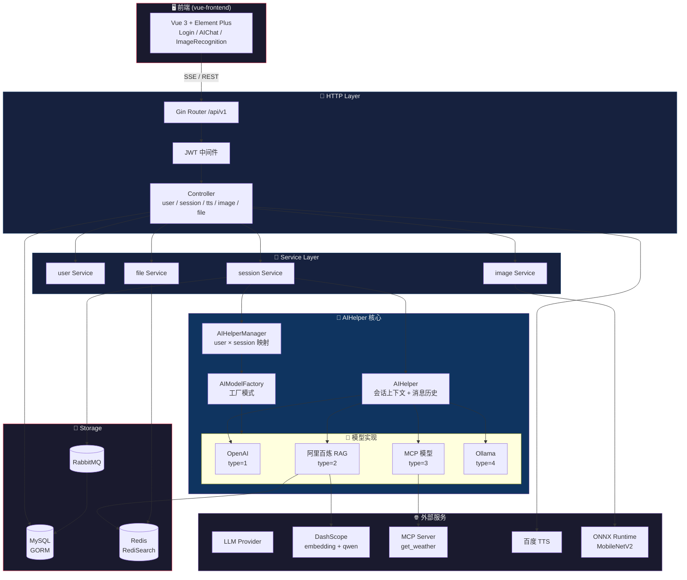
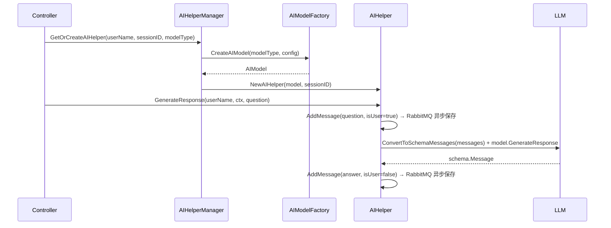
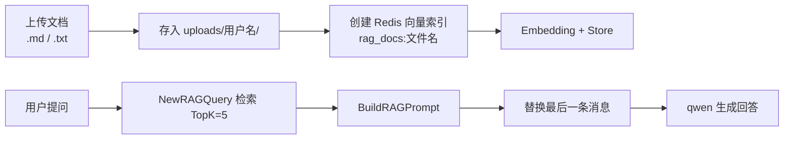
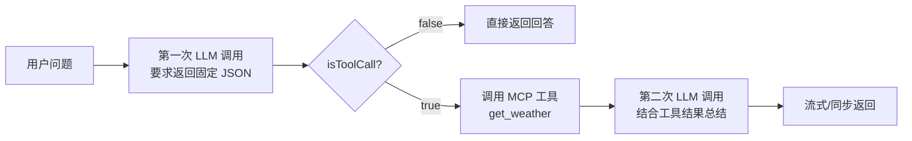
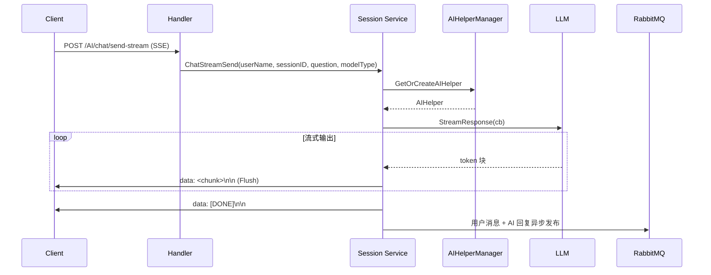
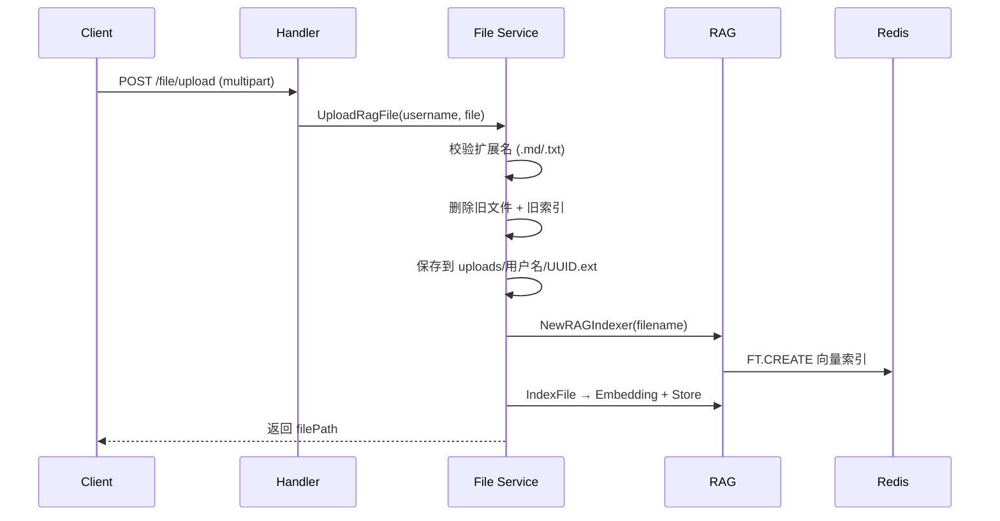

# GopherAI

GopherAI 全栈 AI 助手 —— 基于 [Eino](https://github.com/cloudwego/eino) 框架构建的 Go AI Agent 后端服务（含 Vue3 前端）。

> **面向 AI 阅读**：本 README 为 vibecoding 上下文而设计，涵盖架构、模块职责、数据流、核心概念等，方便 AI 快速理解项目结构并编写代码。

---

## 目录

- [项目概览](#项目概览)
- [技术栈](#技术栈)
- [项目结构](#项目结构)
- [架构图](#架构图)
- [模块详解](#模块详解)
- [核心概念](#核心概念)
- [数据流](#数据流)
- [API 接口](#api-接口)
- [配置说明](#配置说明)
- [快速启动](#快速启动)
- [扩展指南](#扩展指南)

---

## 项目概览

| 属性 | 值 |
|------|------|
| 模块路径 | `GopherAI` |
| 语言 | Go 1.24 |
| Web 框架 | Gin |
| ORM | GORM (MySQL) |
| AI 框架 | cloudwego/eino（ChatModel 抽象） |
| LLM 支持 | OpenAI / Ollama / 阿里百炼（qwen） |
| 前端 | Vue 3 + Element Plus（`vue-frontend/`） |
| 消息队列 | RabbitMQ（异步消息落库） |
| 缓存 / 向量库 | Redis + RediSearch（RAG 向量索引） |
| MCP | mark3labs/mcp-go（独立子项目） |
| TTS | 百度语音合成 |
| 图像识别 | ONNX Runtime（MobileNetV2 本地推理） |
| 鉴权 | JWT + 邮箱验证码 |

**核心能力**：流式/非流式 AI 对话、多模型插件化（工厂模式）、基于个人文档的 RAG 问答、MCP 工具调用（天气查询）、语音合成、本地图像分类、邮箱注册登录。

---

## 技术栈

```
┌─────────────────────────────────────────────────────────┐
│  HTTP Layer       Gin + JWT 中间件 + SSE                 │
│  AI Engine        Eino ChatModel + AIHelper 会话上下文    │
│  LLM Providers    OpenAI / Ollama / 百炼 qwen / MCP      │
│  Tool Protocol    MCP (StreamableHTTP)                   │
├─────────────────────────────────────────────────────────┤
│  Storage          MySQL (GORM) + Redis (RediSearch)      │
│  MQ               RabbitMQ（Work 模式异步消费）           │
├─────────────────────────────────────────────────────────┤
│  外部服务         百度 TTS / 阿里 DashScope / MCP Server  │
│  Local Infer      ONNX Runtime (MobileNetV2)             │
└─────────────────────────────────────────────────────────┘
```

---

## 项目结构

```
GopherAI-v2/
├── main.go                           # 程序入口（初始化 MySQL → 加载历史 → Redis → RabbitMQ → 启动 HTTP）
│
├── config/                           # ⚙️ TOML 配置加载 + 结构定义
│   ├── config.go                     #   Config 结构体 + 懒加载单例 GetConfig()
│   └── config.toml                   #   环境配置（MySQL / Redis / RabbitMQ / JWT / RAG / TTS）
│
├── router/                           # 🚏 Gin 路由注册
│   ├── router.go                     #   /api/v1 分组，/AI、/image、/file 挂 JWT 鉴权
│   ├── user.go                       #   用户模块路由（register / login / captcha）
│   ├── AI.go                         #   AI 模块路由（chat / tts / stream）
│   ├── Image.go                      #   图像识别路由
│   └── File.go                       #   文件上传路由
│
├── controller/                       # 📡 HTTP 接口层（请求解析 + 响应封装）
│   ├── common.go                     #   Response 统一响应结构（status_code + status_msg）
│   ├── user/user.go                  #   注册 / 登录 / 验证码
│   ├── session/session.go            #   会话、聊天、历史、SSE 流式
│   ├── tts/tts.go                    #   TTS 任务创建 / 查询
│   ├── image/image.go                #   图片识别
│   └── file/file.go                  #   RAG 文档上传
│
├── service/                          # 💼 业务逻辑层
│   ├── user/user.go                  #   登录校验、注册（验证码 + 随机账号）、发验证码
│   ├── session/session.go            #   会话管理 + AIHelper 编排 + SSE 流式输出
│   ├── image/image.go                #   调用 ONNX 图像识别器
│   └── file/file.go                  #   RAG 文件上传 + 向量索引构建
│
├── dao/                              # 📦 数据访问层（GORM 查询封装）
│   ├── user/user.go                  #   用户查询 / 注册
│   ├── session/session.go            #   会话 CRUD
│   └── message/message.go            #   消息查询 / 创建
│
├── model/                            # 💾 数据模型（GORM AutoMigrate）
│   ├── user.go                       #   t_user（唯一索引 username）
│   ├── session.go                    #   t_session（uuid 主键）
│   └── message.go                    #   t_message（session_id 索引）
│
├── middleware/                       # 🛡 中间件
│   └── jwt/jwt.go                    #   JWT 鉴权（Authorization: Bearer / ?token=）
│
├── common/                           # 🔧 共享基础设施（核心）
│   ├── aihelper/                     #   🧠 AI 助手核心
│   │   ├── aihelper.go               #     AIHelper（会话上下文 + 消息历史 + 异步保存）
│   │   ├── manager.go                #     AIHelperManager（用户×会话 映射 + 单例）
│   │   ├── factory.go                #     AIModelFactory（模型类型 → 创建器，工厂模式）
│   │   └── model.go                  #     AIModel 接口 + 4 种模型实现
│   ├── rag/                          #   📚 RAG 检索增强（Eino + Redis 向量索引）
│   ├── mcp/                          #   🔌 MCP 子项目（独立 go.mod：github.com/kaitai/gopherai-mcp）
│   │   ├── main.go                   #     命令行入口（--mode server/client）
│   │   ├── server/server.go          #     MCP Server（get_weather 工具）
│   │   └── client/client.go          #     MCP Client 封装
│   ├── tts/                          #   🔊 百度语音合成
│   ├── image/                        #   🖼 ONNX 图像识别器（MobileNetV2）
│   ├── email/                        #   📧 QQ 邮箱验证码（gomail）
│   ├── redis/                        #   🔴 Redis 客户端 + RediSearch 索引管理
│   ├── rabbitmq/                     #   🐰 RabbitMQ 封装（Work 模式 + 消息消费落库）
│   ├── mysql/                        #   🗄 GORM 初始化 + AutoMigrate
│   └── code/                         #   📟 统一错误码体系
│
├── utils/                            # 🧰 工具函数
│   ├── utils.go                      #   MD5 / UUID / 随机数 / 消息转换 / 文件校验
│   └── myjwt/jwt.go                  #   JWT 生成 / 解析
│
├── vue-frontend/                     # 🖥 Vue 3 前端（Element Plus + axios + vue-router）
│   └── src/
│       ├── views/                    #   Login / Register / Menu / AIChat / ImageRecognition
│       ├── router/index.js           #   路由 + 登录守卫
│       └── utils/api.js              #   axios 封装（自动携带 JWT）
│
├── go.mod / go.sum                   # 依赖管理
└── num1.go                           # 单例模式示例（学习文件，非业务代码）
```

### 依赖方向（严格单向）

```
router → controller → service → dao → model
   │           │          │
   │           └──────→ common/aihelper ─→ common/rabbitmq → dao
   │                        │
   │                        └──→ common/rag → common/redis
   │                                    │
   │                                    └──→ config
   └──────→ middleware/jwt → utils/myjwt → config
```

**规则**：业务代码自上而下单向依赖，`common/` 为共享基础设施，`config` 在最底层被全项目引用。

---

## 架构图



---

## 模块详解

### 1. `main.go` — 启动入口

启动顺序：
1. 加载 TOML 配置（`GetConfig()` 懒加载单例）
2. 初始化 MySQL 并 AutoMigrate（User / Session / Message）
3. 从数据库加载全部历史消息，重建 `AIHelperManager`（`readDataFromDB`）
4. 初始化 Redis（验证码 + RAG 向量库）
5. 初始化 RabbitMQ（启动 "Message" 队列消费者，异步落库）
6. 启动 HTTP 服务（`host:port`）

### 2. `router/` + `controller/` — 路由与接口层

| 文件 | 职责 |
|------|------|
| `router/router.go` | `/api/v1` 分组；`/AI`、`/image`、`/file` 挂 JWT 鉴权中间件 |
| `controller/user/user.go` | 注册（邮箱验证码）、账号密码登录、发送验证码 |
| `controller/session/session.go` | 会话列表、新建会话+聊天、聊天、历史、SSE 流式聊天 |
| `controller/tts/tts.go` | TTS 任务创建（返回 `task_id`）与轮询查询 |
| `controller/image/image.go` | 图片识别（multipart 上传 → 返回类别名） |
| `controller/file/file.go` | RAG 文档上传（.md / .txt → 向量化） |
| `controller/common.go` | 统一响应结构 `Response{StatusCode, StatusMsg}` |

### 3. `service/` — 业务逻辑层

| 文件 | 职责 |
|------|------|
| `user/user.go` | 登录校验（MD5 比对）、注册（验证码校验 → 生成 11 位随机账号 → 邮箱通知账号）、发验证码 |
| `session/session.go` | 会话 CRUD + AIHelper 编排：同步生成 / SSE 流式生成（`data:` 事件 + `[DONE]`） |
| `file/file.go` | RAG 文件校验 → 按用户目录存储 → 重建向量索引（每用户仅保留一个文档） |
| `image/image.go` | 调用 ONNX MobileNetV2 识别器，返回 ImageNet 类别 |

### 4. `common/aihelper/` — AI 助手核心

| 文件 | 职责 | 设计模式 |
|------|------|----------|
| `aihelper.go` | `AIHelper`：绑定一个会话，维护消息历史，`saveFunc` 回调异步保存 | **回调** |
| `manager.go` | `AIHelperManager`：`map[userName]map[sessionID]*AIHelper` | **单例** |
| `factory.go` | `AIModelFactory`：按 `modelType` 字符串创建模型 | **工厂模式** |
| `model.go` | `AIModel` 接口 + 4 种实现（OpenAI / RAG / MCP / Ollama） | **策略/适配器** |

**AIModel 接口**：

```go
type AIModel interface {
    GenerateResponse(ctx context.Context, messages []*schema.Message) (*schema.Message, error)
    StreamResponse(ctx context.Context, messages []*schema.Message, cb StreamCallback) (string, error)
    GetModelType() string
}
```

**模型类型对照表**：

| modelType | 实现 | 说明 |
|------|------|------|
| `"1"` | `OpenAIModel` | 任意 OpenAI 兼容接口（环境变量配置） |
| `"2"` | `AliRAGModel` | 阿里百炼 qwen + 用户文档 RAG 检索 |
| `"3"` | `MCPModel` | 通过 MCP Server 调用工具（两阶段 LLM 调用） |
| `"4"` | `OllamaModel` | 本地 Ollama（接口已实现，未提供应用） |

### 5. `common/rag/` — RAG 检索增强

基于 Eino 组件实现，Redis RediSearch 存向量：

- `NewRAGIndexer`：创建 Embedding（ark）+ Redis 向量索引 + Indexer
- `IndexFile`：读取文件 → 向量化 → 存入 Redis（前缀 `rag_docs:<文件名>:`）
- `NewRAGQuery`：Embedding + Redis Retriever（`FT.SEARCH` 余弦相似度，TopK=5）
- `BuildRAGPrompt`：把检索文档拼进提示词，替换最后一条用户消息

### 6. `common/mcp/` — MCP 子项目

独立 `go.mod`（module `github.com/kaitai/gopherai-mcp`），提供天气查询示例：

```
go run main.go --mode server --http-addr :8081     # 启动 MCP Server (StreamableHTTP)
go run main.go --mode client --city "北京"           # 客户端调用 get_weather 工具
```

主项目 `MCPModel`（type=3）内置 MCP Client，通过 `http://localhost:8081/mcp` 调用工具。

### 7. `common/` — 其他基础设施

| 包 | 职责 |
|------|------|
| `redis` | go-redis/v9 客户端 + `FT.CREATE` / `FT.DROPINDEX` 索引管理 + 验证码存取 |
| `rabbitmq` | Work 模式封装；`Message` 队列消费者把消息异步写入 MySQL |
| `mysql` | GORM 初始化、连接池、AutoMigrate |
| `email` | QQ 邮箱 SMTP 发送验证码（gomail/v2） |
| `tts` | 百度 TTS：获取 access_token → 创建任务 → 查询结果 |
| `image` | ONNX Runtime 图像识别（MobileNetV2，224×224） |
| `code` | 统一错误码（1000 成功 / 2xxx 用户 / 4xxx 服务 / 5xxx 模型 / 6xxx TTS） |

### 8. `utils/` + `middleware/`

| 文件 | 职责 |
|------|------|
| `utils/utils.go` | MD5、UUID、随机数字、`ConvertToSchemaMessages`（DB→Eino）、文件校验（仅 .md/.txt） |
| `utils/myjwt/jwt.go` | HS256 签名，Claims 携带 ID + Username |
| `middleware/jwt/jwt.go` | 解析 `Authorization: Bearer` 或 `?token=`，将 `userName` 写入 Gin Context |

---

## 核心概念

### 1. AIHelperManager + AIHelper（一个会话一个助手）



**为什么一个会话绑定一个 AIHelper？** 消息历史保存在内存中，直接作为 LLM 上下文，避免每次请求重复查库。由 `AIHelperManager` 统一管理映射关系，`sync.Once` 保证全局唯一。

### 2. 模型工厂（可插拔）

通过 `modelType` 字符串注册创建器，新增模型只需调用 `RegisterModel`：

```go
// 示例：注册自定义模型
GetGlobalFactory().RegisterModel("5", func(ctx context.Context, config map[string]interface{}) (AIModel, error) {
    return NewMyModel(ctx, config)
})
```

### 3. RAG 问答机制



**每用户单文档约束**：上传新文件会先删除旧文件及对应 Redis 索引。

### 4. MCP 模型（两阶段调用）

`MCPModel` 不使用原生 Tool Calling，而是提示词约束：



### 5. 消息异步落库

AI 回复不阻塞等待 DB 写入：`AIHelper.saveFunc` 把消息 JSON 化后发布到 RabbitMQ "Message" 队列，独立消费者协程完成 `dao/message.CreateMessage`。

---

## 数据流

### 流式聊天（SSE）



### 新建流式会话

先下发 `sessionId`，前端侧边栏立即出现新标签，随后开始流式输出：

```
data: {"sessionId": "xxx-xxx"}

data: 你好，我是...
data: [DONE]
```

### RAG 文件上传



---

## API 接口

所有接口前缀 `/api/v1`，响应统一为 `{status_code, status_msg, ...}`。

### 用户接口（无需鉴权）

| 方法 | 路径 | 说明 |
|------|------|------|
| POST | `/user/register` | 邮箱注册（需验证码），注册成功后直接登录 |
| POST | `/user/login` | 账号 + 密码登录，返回 JWT Token |
| POST | `/user/captcha` | 发送邮箱验证码（2 分钟有效） |

### AI 接口（需 JWT）

| 方法 | 路径 | 说明 |
|------|------|------|
| GET | `/AI/chat/sessions` | 获取当前用户的所有会话 |
| POST | `/AI/chat/send-new-session` | 新建会话并同步发送，返回 sessionId + AI 回答 |
| POST | `/AI/chat/send` | 指定会话同步发送消息 |
| POST | `/AI/chat/history` | 查询会话历史 |
| POST | `/AI/chat/send-stream-new-session` | 新建会话并 SSE 流式发送 |
| POST | `/AI/chat/send-stream` | 指定会话 SSE 流式发送 |
| POST | `/AI/chat/tts` | 创建语音合成任务，返回 task_id |
| GET | `/AI/chat/tts/query` | 轮询查询 TTS 任务（`?task_id=xxx`） |

### 图像 / 文件接口（需 JWT）

| 方法 | 路径 | 说明 |
|------|------|------|
| POST | `/image/recognize` | 图片识别（multipart `image` 字段），返回类别名 |
| POST | `/file/upload` | RAG 文档上传（multipart `file` 字段，仅 .md/.txt） |

### 鉴权方式

`Authorization: Bearer <token>`（或 URL 参数 `?token=`），中间件解析后把 `userName` 注入上下文。

### 请求示例

```bash
# 登录
curl -X POST http://localhost:9090/api/v1/user/login \
  -H "Content-Type: application/json" \
  -d '{"username": "12345678901", "password": "123456"}'
# → {"status_code": 1000, "status_msg": "success", "token": "eyJ..."}

# 流式聊天
curl -N -X POST http://localhost:9090/api/v1/AI/chat/send-stream \
  -H "Content-Type: application/json" \
  -H "Authorization: Bearer eyJ..." \
  -d '{"sessionId": "xxx", "question": "你好", "modelType": "1"}'
# → data: 你好...
# → data: [DONE]

# 图片识别
curl -X POST http://localhost:9090/api/v1/image/recognize \
  -H "Authorization: Bearer eyJ..." \
  -F "image=@cat.jpg"
# → {"status_code": 1000, "class_name": "tabby cat"}
```

---

## 配置说明

配置文件：`config/config.toml`（TOML 格式）

```toml
[mainConfig]
appName = "GopherAI"
host = "0.0.0.0"
port = 9090

[emailConfig]
authcode = "your authcode"    # QQ 邮箱 SMTP 授权码
email = "your qq email"

[redisConfig]
host = "127.0.0.1"
port = 6379
password = ""
db = 0

[mysqlConfig]
host = "127.0.0.1"
port = 3306
user = "root"
password = "123456"
databaseName = "GopherAI"
charset = "utf8mb4"

[jwtConfig]
expire_duration = 8760        # 小时
issuer = "huanheart"
subject = "GopherAI"
key = "GopherAI-v1"           # 签名密钥

[rabbitmqConfig]
host = "rabbitmq"
port = 5672
username = "root"
password = "123456"
vhost = "/"

[ragModelConfig]
embeddingModel = "text-embedding-v4"
chatModelName = "qwen-turbo"
docDir = "./docs"
baseUrl = "https://dashscope.aliyuncs.com/compatible-mode/v1"
dimension = 1024              # 向量维度（需与 embedding 模型一致）

[voiceServiceConfig]
voiceServiceApiKey = "baiduApiKey"
voiceServiceSecretKey = "baiduSecretKey"
```

### 环境变量（OpenAI 兼容模型）

```bash
export OPENAI_API_KEY=sk-xxx        # OpenAI / 百炼 RAG / MCP 模型共用
export OPENAI_MODEL_NAME=gpt-4o-mini
export OPENAI_BASE_URL=https://api.openai.com/v1
```

---

## 快速启动

```bash
# 1. 准备基础设施：MySQL / Redis（含 RediSearch）/ RabbitMQ

# 2. 修改 config/config.toml 填入实际配置

# 3. 设置 OpenAI 兼容 API 的环境变量（模型 type=1/2/3 需要）
export OPENAI_API_KEY=sk-xxx
export OPENAI_MODEL_NAME=gpt-4o-mini
export OPENAI_BASE_URL=https://api.openai.com/v1

# 4. 安装依赖并启动后端
go mod tidy
go run main.go

# 5.（可选）启动 MCP Server（模型 type=3 依赖）
cd common/mcp
go run main.go --mode server --http-addr :8081

# 6.（可选）启动前端
cd vue-frontend
npm install
npm run serve
```

---

## 扩展指南

### 新增模型类型

1. 在 `common/aihelper/model.go` 实现 `AIModel` 接口
2. 在 `factory.go` 的 `registerCreators()` 注册（或运行时调用 `RegisterModel`）

```go
// 示例：注册一个模型类型
GetGlobalFactory().RegisterModel("5", func(ctx context.Context, config map[string]interface{}) (AIModel, error) {
    return NewMyModel(ctx, config)
})
```

### 新增 MCP 工具

在 `common/mcp/server/server.go` 中 `AddTool`：

```go
mcpServer.AddTool(
    mcp.NewTool("tool_name", mcp.WithDescription("工具描述"), mcp.WithString("param")),
    func(ctx context.Context, req mcp.CallToolRequest) (*mcp.CallToolResult, error) {
        // 实现工具逻辑
        return &mcp.CallToolResult{Content: []mcp.Content{mcp.TextContent{Text: "result"}}}, nil
    },
)
```

### 新增 API

1. 在 `controller/` 下创建处理器（复用 `controller.Response`）
2. 在 `router/` 下注册路由（需鉴权则挂 `jwt.Auth()`）
3. 业务逻辑放 `service/`，数据访问放 `dao/`，模型定义放 `model/`

### 新增数据表

1. 在 `model/` 定义结构体（GORM tag）
2. 在 `common/mysql/mysql.go` 的 `migration()` 中加入 `AutoMigrate`

---

## 关键设计决策

| 决策 | 原因 |
|------|------|
| 一个会话绑定一个 AIHelper（内存历史） | 避免每次请求查库构建上下文，降低延迟 |
| AIHelperManager 全局单例 | 统一管理用户×会话映射，`sync.Once` 线程安全 |
| 模型工厂（modelType 字符串） | 模型可插拔，前端通过参数切换，无需重启 |
| RabbitMQ 异步落库（回调） | 消息持久化不阻塞 AI 回复，DB 抖动不影响对话 |
| 每用户仅保留一个 RAG 文档 | 简化知识库隔离，上传新文档自动重建索引 |
| Redis RediSearch 向量索引 | 复用已有 Redis，避免引入独立向量数据库 |
| MCP 两阶段提示词调用 | 不依赖 LLM 原生 Tool Calling，兼容性更好 |
| 消息转换集中到 utils | DB 消息与 Eino schema 消息双向转换，单一职责 |
