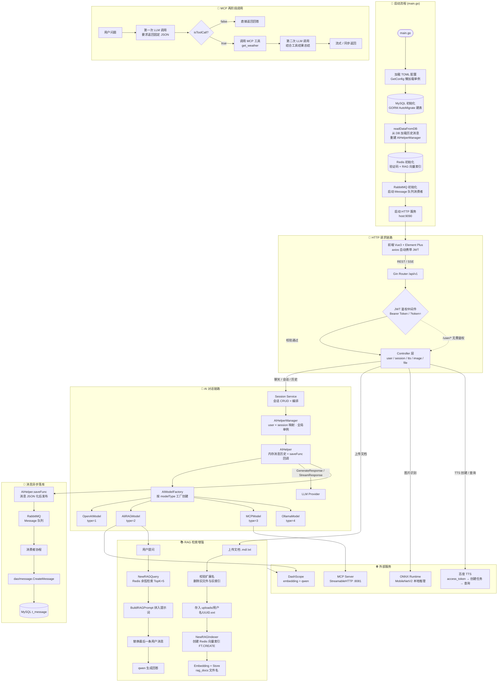

# GopherAI 整体流程图

> 根据 README.md 生成。使用 Mermaid 语法，可在 GitHub / VSCode / Typora 等支持 Mermaid 的编辑器中直接预览。

---

## 图说明

| 子图 | 对应 README 章节 |
|------|------------------|
| 🚀 启动流程 | 「模块详解 → main.go 启动入口」 |
| 📡 HTTP 请求链路 | 「架构图」+「API 接口」 |
| 🧠 AI 对话链路 | 「核心概念 1. AIHelperManager + AIHelper」|
| 💾 消息异步落库 | 「核心概念 5. 消息异步落库」 |
| 📚 RAG 检索增强 | 「核心概念 3. RAG 问答机制」+「数据流 → RAG 文件上传」 |
| 🔌 MCP 两阶段调用 | 「核心概念 4. MCP 模型（两阶段调用）」 |
| 🌐 外部服务 | 「技术栈」+「模块详解」 |
